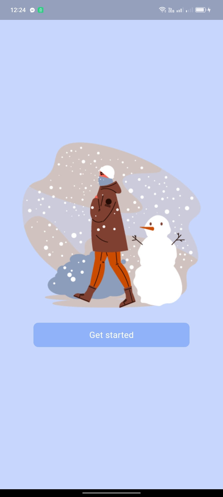
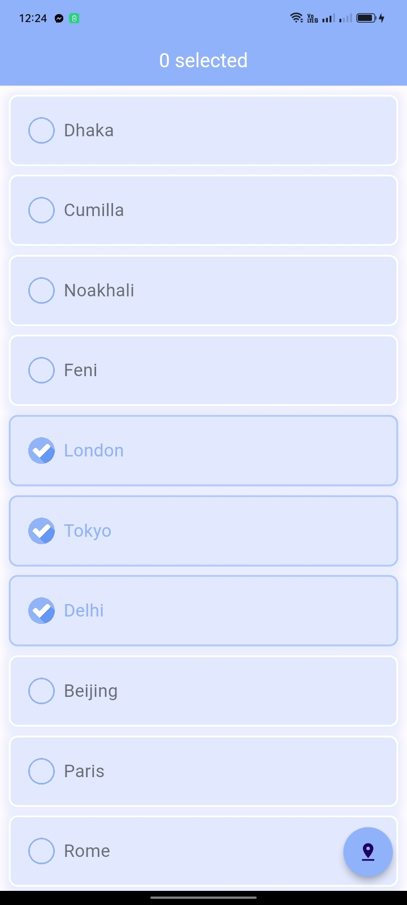
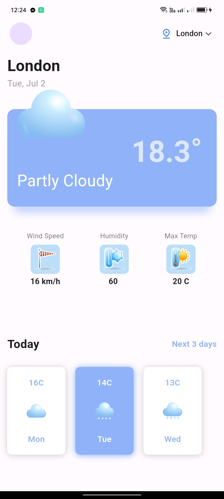
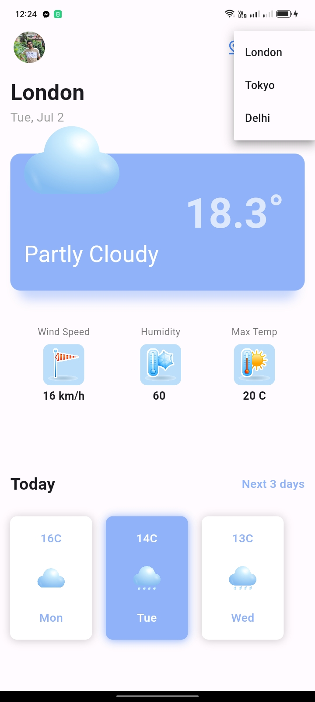
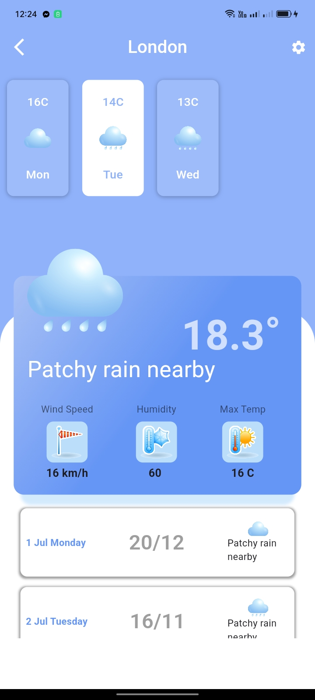

# This app forecast weather update from API

## This are the all screen of this app

<h3>Welcome Screen</h3>

<h3>Choose city</h3>

<h3>Home Screen 1</h3>

<h3>Home Screen 2</h3>

<h3>Detail Screen</h3>
